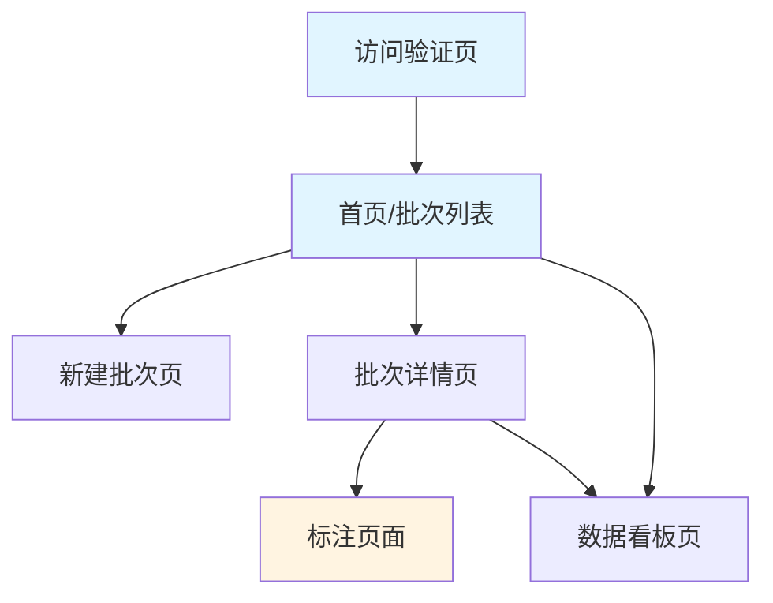

# AI知识问答效果评测标注工具 - 产品原型说明

## 1. 产品概述

本工具是一款面向AI知识问答系统的效果评测与人工标注平台，专注于搬家助手类AI能力的质量评估。通过结构化的标注流程和可视化的数据分析，帮助产品团队系统性地评估AI问答效果，发现模型缺陷，指导优化方向。

**核心价值**：

* 建立标准化的AI问答质量评估体系

* 支持多人协同标注，提升评测效率

* 提供多维度的数据分析看板，量化AI能力表现

* 沉淀评测数据，形成持续优化的闭环

***

## 2. 核心功能模块

### 2.1 用户角色

| 角色    | 使用场景             | 核心权限            |
| ----- | ---------------- | --------------- |
| 标注管理员 | 创建评测批次、分配任务、查看数据 | 全量功能访问权限        |
| 标注员   | 执行样本标注           | 仅可访问被分配的批次和标注页面 |

### 2.2 功能模块列表

1. **访问控制模块**：统一访问口令验证，保障数据安全
2. **批次管理模块**：创建标注批次、上传评测数据、分配标注人
3. **标注作业模块**：单条样本查看与标注、进度追踪、上下条导航
4. **数据看板模块**：批次级统计指标、分布图表、核心指标监控
5. **数据导出模块**：标注结果导出为CSV格式

### 2.3 页面详情

| 页面名称    | 模块名称  | 功能描述                                             |
| ------- | ----- | ------------------------------------------------ |
| 访问验证页   | 口令输入  | 输入统一访问口令进行身份验证，验证通过后7天内免登录                       |
| 首页/批次列表 | 批次概览  | 展示所有标注批次，显示批次名称、样本数量、标注人数、完成进度、状态标签              |
| 首页/批次列表 | 批次操作  | 支持创建新批次、删除批次、查看批次详情、查看数据看板                       |
| 新建批次页   | 批次信息  | 输入批次名称，支持添加多位标注人                                 |
| 新建批次页   | 数据上传  | 上传Excel文件（.xlsx/.xls），自动检测字段，预览前3条数据，最大支持5000条样本 |
| 批次详情页   | 样本分配  | 展示样本自动分配结果，各标注人任务量                               |
| 批次详情页   | 标注入口  | 标注人选择入口，点击进入标注界面                                 |
| 批次详情页   | 导出功能  | 导出批次标注结果为CSV格式                                   |
| 标注页面    | 样本展示  | 三栏布局：左侧用户问题与AI输出、中间知识召回依据、右侧标注表单                 |
| 标注页面    | 格式化展示 | 知识召回结果卡片化展示、AI输出Markdown渲染、行动建议与猜你想问格式化          |
| 标注页面    | 标注表单  | 10个标注维度：意图清晰度、分类准确性、知识覆盖、召回准确性、回复质量等             |
| 标注页面    | 导航操作  | 上一条/下一条切换、保存、保存并完成                               |
| 数据看板页   | 核心指标  | AI回复加权可用率（主指标）、基础可用率                             |
| 数据看板页   | 过程指标  | 意图清晰率、搬家意图分类准确率、知识覆盖率、知识召回准确率                    |
| 数据看板页   | 分布图表  | 6个维度的柱状图分布展示                                     |

***

## 3. 核心流程

### 3.1 管理员流程

```
访问验证 → 创建批次 → 上传Excel → 系统自动分配 → 查看进度 → 查看数据看板 → 导出结果
```

### 3.2 标注员流程

```
访问验证 → 选择批次 → 选择标注人身份 → 开始标注 → 逐条填写标注 → 保存并继续 → 完成全部
```

### 3.3 页面导航流程图



***

## 4. 标注维度说明

### 4.1 标注字段清单

| 字段            | 类型  | 选项              | 说明                   |
| ------------- | --- | --------------- | -------------------- |
| A. 是否为意图清晰问题  | 单选  | 是/否             | 判断用户提问意图是否明确         |
| B. 搬家意图分类是否准确 | 单选  | 是/否             | AI对用户意图的分类是否正确       |
| C. 知识库内是否有知识  | 单选  | 有/没有            | 该问题在知识库中是否有对应知识      |
| D. 对应知识标题     | 文本  | -               | 当C选"有"时填写            |
| E. 知识召回是否准确   | 单选  | 是/否             | AI召回的知识片段是否准确        |
| F. AI回复质量     | 单选  | 完全可用/部分可用/完全不可用 | 综合评估AI回复质量           |
| G. 不可用原因      | 多选  | 7个选项            | 当F选"部分可用"或"完全不可用"时显示 |
| H. 备注         | 文本域 | -               | 可选填写                 |
| I. 行动建议内容是否相关 | 单选  | 是/否             | 行动建议是否与问题相关          |
| J. 猜你想问至少不离谱  | 单选  | 是/否             | 推荐问题是否合理             |

### 4.2 AI回复质量定义

* **完全可用**：能够完全解决用户的问题，回复内容准确、完整、格式标准且表达逻辑清晰

* **部分可用**：包含用户提问问题的关键内容或者信息，能够在一部分程度上帮助用户解决问题，但是存在缺陷

* **完全不可用**：答案内容对用户来说没有帮助，属于答非所问、无法解答或者存在明显逻辑错误

### 4.3 不可用原因选项

* 事实不准确

* 链接不准确

* 引用参考不准确

* 回答结果没有覆盖必要信息（如前置依赖条件或操作步骤）

* 答案格式显示不正确

* 表达逻辑混乱

* 表达结构不完整

***

## 5. 数据统计指标

### 5.1 核心指标

| 指标名称      | 计算口径                     | 用途              |
| --------- | ------------------------ | --------------- |
| AI回复加权可用率 | (完全可用×1 + 部分可用×0.5) / 全量 | 综合评价AI回复质量的核心指标 |
| AI回复基础可用率 | (完全可用 + 部分可用) / 全量       | 基础可用性指标         |

### 5.2 过程指标

| 指标名称      | 计算口径             | 用途        |
| --------- | ---------------- | --------- |
| 意图清晰率     | 意图清晰问题数 / 全量已标注  | 评估用户提问质量  |
| 搬家意图分类准确率 | 意图分类准确数 / 全量已标注  | 评估意图识别能力  |
| 知识覆盖率     | 有知识数 / 意图准确的搬家问题 | 评估知识库覆盖度  |
| 知识召回准确率   | 召回准确数 / 有知识的问题   | 评估RAG召回能力 |

***

## 6. 用户界面设计

### 6.1 设计规范

* **主色调**：蓝色系（#3b82f6 为主色）

* **辅助色**：绿色（成功）、橙色（警告）、红色（错误）、紫色（数据看板强调）

* **布局风格**：卡片式布局、三栏标注界面

* **字体**：系统默认字体，中文优先

* **圆角**：统一使用 rounded-lg（8px）

* **阴影**：使用 shadow-sm 和 shadow-lg 营造层次感

### 6.2 页面布局

**首页（批次列表）**：

* 顶部标题栏 + 新建批次按钮

* 批次卡片网格布局

* 每张卡片展示：批次名称、状态标签、样本数、标注人数、完成进度条、操作按钮

**标注页面（三栏布局）**：

* **左栏（40%）**：用户问题与AI输出

  * 顶部Sticky：用户输入（高亮展示）、辅助信息网格（意图分类、搬家阶段、对象、状态）

  * 滚动区域：意图分类结果、AI最终输出（Markdown渲染）、行动建议、猜你想问

* **中栏（35%）**：AI召回知识依据

  * 知识片段卡片列表

  * 每条展示：序号、标签、标题、内容、评分、来源链接

* **右栏（25%）**：人工标注表单

  * 10个标注维度表单

  * 单选、多选、文本输入组合

**数据看板页**：

* 顶部导航 + 批次信息

* 核心指标大卡片（紫色渐变背景）

* 过程指标小卡片（4个网格）

* 分布图表区域（6个柱状图）

* 统计口径说明

### 6.3 响应式设计

* 桌面端优先设计

* 标注页面最小宽度要求 1280px

* 数据看板页自适应网格布局

***

## 7. 数据输入规范

### 7.1 Excel字段要求

上传的Excel文件需包含以下字段：

| 字段名                                  | 业务含义       | 数据类型            |
| ------------------------------------ | ---------- | --------------- |
| `__system_internal_id__`             | 用户提问ID     | 字符串             |
| `input_input`                        | 用户输入       | 字符串             |
| `input_expect_classfiy`              | 预期意图分类     | 字符串             |
| `input_step`                         | 搬家阶段       | 字符串             |
| `input_object`                       | 系统推荐搬家对象   | 字符串             |
| `input_status`                       | 搬家状态       | 字符串             |
| `output_actual_output`               | AI最终输出     | 字符串（Markdown格式） |
| `node_Script_uncA_output`            | 行动建议内容     | JSON字符串         |
| `node_Script_hBH1_output`            | 猜你想问内容     | JSON字符串         |
| `node_Script_tezR_output`            | AI打标意图分类   | 字符串             |
| `node_Script_oRFz_output`            | AI打标意图分类原因 | 字符串             |
| `node_ZhiShangRAGRerank_zIOZ_output` | AI召回知识结果   | JSON字符串         |

### 7.2 数据限制

* 单批次最大样本数：5000条

* 支持文件格式：.xlsx, .xls

* 标注人

